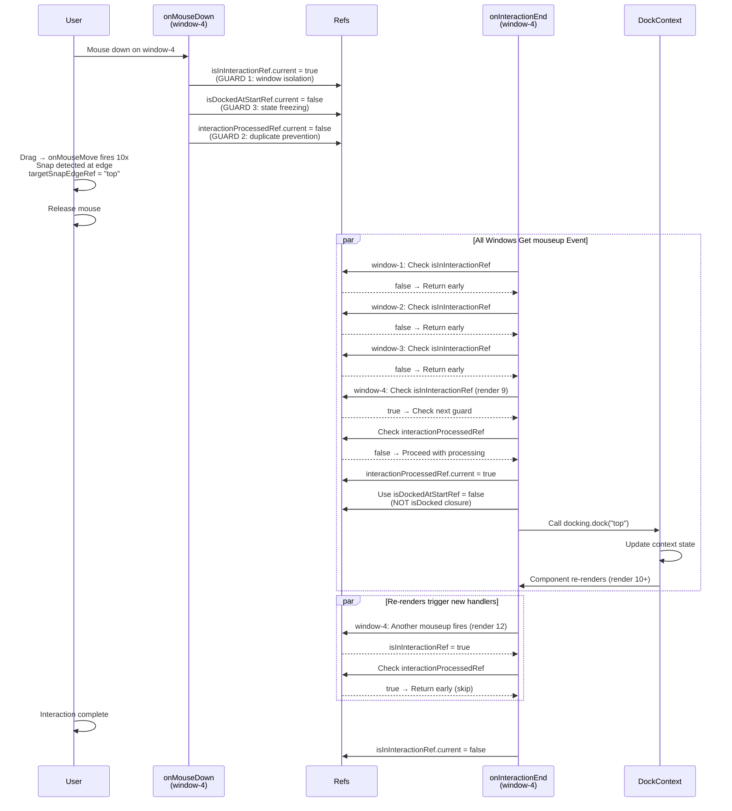

# ContextWindow Component Architecture & Flow Diagrams

## Overview

`ContextWindow` is a draggable, dockable window component in React that enables:

- **Floating mode**: Windows float freely and can be dragged around
- **Docked mode**: Windows snap to screen edges (top, bottom, left, right) and dock into a sidebar panel
- **Snap detection**: Visual feedback when dragging near screen edges
- **Z-index management**: Automatic stacking and focus management

---

## Key State Variables

### Position & Movement

- **`windowPos.current: { x: number, y: number }`** - Cumulative translate offset from drag movements
- **`moving: boolean`** - Whether mouse is currently dragging the window
- **`preDockState: { x, y, width, height } | null`** - Saved position/size before docking (for restore on undock)
- **`isDocked: boolean`** - Whether window is currently in a dock panel

### Visibility & Interaction

- **`windowVisible: boolean`** - **CRITICAL**: Gates whether `onInteractionEnd` fires
  - Set `true` on `onMouseDown` when drag starts
  - Set `true` when window enters viewport during drag
  - Set `false` when window leaves DOM
  - Controls `interactionEndEnabled` flag on useMouseMove hook
- **`windowInDOM: boolean`** - Whether window is actually rendered in DOM
- **`isDraggingForDock: boolean`** - Whether currently dragging with intent to dock

### Snap Detection

- **`targetSnapEdge: DockEdge | null`** - React state for snap edge (updates UI)
- **`targetSnapEdgeRef.current: DockEdge | null`** - **CRITICAL**: Synchronous ref for snap edge
  - Provides reliable value during `onInteractionEnd` closure
  - Set in `onMouseMove` when snap edge detected
  - Read in `onInteractionEnd` to determine dock target
  - Cleared after docking/release
- **`lastMousePosRef.current: { x, y }`** - Current mouse position during drag

### Docking Context

- **`dockedWindow: DockedWindow | undefined`** - Current docking state from context
  - Contains: `{ id, edge, stackDirection, isCollapsed, order }`
- **`docking: DockingContext | null`** - Reference to docking context manager

---

## Constants

```typescript
const SNAP_THRESHOLD = 24; // px from edge to trigger snap
const UNDOCK_THRESHOLD = 20; // px from edge to trigger undock when dragging docked window
const MIN_Z_INDEX = 3000; // Minimum z-index for floating windows
const MAX_Z_INDEX = 3010; // Maximum z-index before reset
```

---

## Critical Functions

### `detectSnapEdge(mouseX: mouseY): DockEdge | null`

Detects if mouse is within SNAP_THRESHOLD (24px) of viewport edge.

**Conditions that must all be true:**

1. `dockable === true` (window has docking enabled)
2. `docking !== null` (DockingContext is available)
3. `isDocked === false` (already floating, not docked)

**Returns:** `"top" | "right" | "bottom" | "left" | null`

**Blocked by:** Any condition above being false, or mouse not near edge

---

### `handleDock(edge: DockEdge, stackDirection: StackDirection)`

Saves window's current position and docks it to specified edge.

**Flow:**

1. Get current visual position (DOM left/top + transform offset)
2. Save to `preDockState` for future undocking
3. Call `docking.dock()` to register in context
4. CSS classes take over positioning (absolute/fixed rules)

**Key insight:** Position is calculated as `left_value + windowPos.current.x + top_value + windowPos.current.y` because position involves both DOM styles AND transform translate.

---

### `handleUndock(fromAction: boolean = false)`

Restores window to pre-dock position and removes from docking panel.

**Flow:**

1. Restore DOM `left`, `top` from `preDockState`
2. Clear `transform` property
3. Restore width/height from `preDockState`
4. Set `undockViaActionRef.current = fromAction` flag
5. Call `docking.undock()` to update context
6. If action-based undock: useEffect will call `checkPosition()` to bounce on-screen

**Key insight:** Position is restored via DOM styles (not transform) so transform translate doesn't compound the off-screen position.

---

### `checkPosition()`

Bounces window back on-screen if any part is off-screen.

Calls `chkPosition()` function which returns translate offset needed to keep window in viewport, then applies via transform.

Used when:

- Undocking from action (button click)
- Window resized via CSS resize handle
- Viewport resized

---

## State Machine: Drag-Based Dock Flow

```mermaid
stateDiagram-v2
    [*] --> Floating: window added to DOM

    Floating --> Floating: hover over window

    Floating --> MovingNotSnapped: onMouseDown\n(forcing windowVisible=true)
    note right of MovingNotSnapped
        - moving=true
        - isDraggingForDock=true
        - windowVisible=true (forced)
        - targetSnapEdge=null
    end

    MovingNotSnapped --> MovingWithSnap: onMouseMove\nNear edge (24px)\n+ detectSnapEdge succeeds
    note right of MovingWithSnap
        - moving=true
        - isDraggingForDock=true
        - windowVisible=true
        - targetSnapEdge=edge
        - targetSnapEdgeRef.current=edge
    end

    MovingWithSnap --> MovingNotSnapped: onMouseMove\nMoved away\nfrom edge
    note right of MovingNotSnapped
        - moving=true
        - isDraggingForDock=true
        - windowVisible=true
        - targetSnapEdge=null
    end

    MovingNotSnapped --> MovingWithSnap: onMouseMove\nNear edge again

    MovingWithSnap --> Docked: onMouseUp\n(release near edge)
    note right of Docked
        - onInteractionEnd fires\n  ONLY because windowVisible=true
        - Checks targetSnapEdgeRef.current
        - Calls handleDock(edge)
        - CSS classes applied
        - position: fixed (sidebar)
        - moving=false
        - isDocked=true
    end

    MovingNotSnapped --> Floating: onMouseUp\n(release away from edge)
    note right of Floating
        - onInteractionEnd fires\n  ONLY because windowVisible=true
        - targetSnapEdgeRef.current = null
        - No dock triggered
        - checkPosition() called\n  (bounce back on-screen)
        - moving=false
        - isDraggingForDock=false
    end

    Docked --> Docked: isDocked=true\nCSS controls position
```

---

## State Machine: Action-Based Dock Flow (Dock Button)

```mermaid
stateDiagram-v2
    Floating --> Docking: User clicks dock button\nhandleDock(edge)
    note right of Docking
        - Saves position to preDockState
        - Calls docking.dock(edge)
        - isDocked changed to true\n  (async context update)
    end

    Docking --> Docked: isDocked context updated
    note right of Docked
        - CSS classes applied
        - position: fixed (sidebar)
        - windowVisible may still be true\n  or may have been set by drag
        - targetSnapEdgeRef cleared
        - isDocked=true
    end
```

---

## State Machine: Drag-Based Undock Flow

```mermaid
stateDiagram-v2
    Docked --> DraggingFromDock: User drags window\n(onMouseDown)
    note right of DraggingFromDock
        - windowPos.current reset from transform
        - moving=true
        - isDraggingForDock=true
        - windowVisible=true (or already was)
        - Transform starts accumulating translate
    end

    DraggingFromDock --> DraggingFromDock: onMouseMove\nWithin UNDOCK_THRESHOLD

    DraggingFromDock --> Undocking: onMouseMove\nMoved >20px from edge\nhandleUndock() triggered
    note right of Undocking
        - Restores preDockState to DOM\nleft/top styles
        - Clears transform
        - Calls docking.undock()
        - isDocked changes to false\n  (async context update)
        - undockViaActionRef=false\n  (drag-based, not action)
    end

    Undocking --> Floating: isDocked context updated\n+ useEffect cleanup
    note right of Floating
        - preDockState cleared
        - undockViaActionRef=false\n  so checkPosition NOT called\n  (drag already positioned)
        - moving=true (still dragging)
    end

    Floating --> Floating: Continue dragging\nonMouseMove fires\nsnap detection works
    note right of Floating
        - Window is now floating with\n  partial off-screen position
        - Can snap to edge again!
    end
```

---

## State Machine: Action-Based Undock Flow (Undock Button)

```mermaid
stateDiagram-v2
    Docked --> Undocking: User clicks undock button\nhandleUndock(true)
    note right of Undocking
        - Saves fromAction=true
        - Restores preDockState to DOM\nleft/top styles
        - Clears transform
        - Sets undockViaActionRef.current=true
        - Calls docking.undock()
        - isDocked changes to false\n  (async context update)
        - windowVisible status preserved
    end

    Undocking --> CheckingPosition: isDocked context updated\n+ useEffect fires
    note right of CheckingPosition
        - Checks if !isDocked && preDockState
        - Checks if undockViaActionRef.current
        - CALLS checkPosition()\n  (bounces window on-screen via transform)
        - Sets undockViaActionRef.current=false
    end

    CheckingPosition --> Floating: checkPosition() complete
    note right of Floating
        - Transform applied to ensure\n  window fully on-screen
        - preDockState cleared
        - Ready for next drag or snap
    end
```

---

## Critical Issue: Second Snap Fails

### Diagnosis: Why It Happens

After first dock/undock cycle, the second snap sometimes fails. Here are the causes:

#### **Root Cause 1: `windowVisible` State Not Reset**

```
Cycle 1: ✓ Works
  onMouseDown sets windowVisible=true
  Snap detected, docked
  onMouseUp clears snap indicator
  BUT windowVisible stays true (good!)

Cycle 2: ✓ Should work
  onMouseDown (windowVisible already true, no problem)
  Snap detected
  onMouseUp
  onInteractionEnd FIRES because windowVisible=true
  ✓ Dock works
```

**However, if window goes off-screen between undock and next drag:**

```
Window undocks, partially off-screen
windowVisible MIGHT be set to false somewhere
Next drag: onMouseDown doesn't force windowVisible=true
  (because checks if it's already true first)
onInteractionEnd DOESN'T FIRE because windowVisible=false
✗ Dock fails silently
```

**Fix applied:** `onMouseDown` now unconditionally forces `windowVisible=true`:

```typescript
if (!windowVisible) {
  console.log("Starting drag - forcing windowVisible to true");
  setWindowVisible(true);
}
```

---

#### **Root Cause 2: `targetSnapEdgeRef` Not Cleared After Undock**

```
Cycle 1: ✓ Works
  targetSnapEdgeRef.current = "top" (snap detected)
  onMouseUp → onInteractionEnd → docking triggered
  targetSnapEdgeRef.current = null (cleaned up)

Cycle 2: ✓ Should work
  User drags window again
  targetSnapEdgeRef.current = "right" (new snap detected)
  onMouseUp → onInteractionEnd → reads "right"
  ✓ Dock works
```

**However, if docked window's useEffect runs BEFORE onMouseUp:**

```
isDocked=true, floating styles cleared
useEffect detects isDocked change
Sets targetSnapEdgeRef.current = null
onMouseUp fires → onInteractionEnd
Reads targetSnapEdgeRef.current = null ✗
✗ Dock fails
```

**Fix applied:** useEffect runs AFTER undocking is complete:

```typescript
useEffect(() => {
  if (isDocked && windowRef.current) {
    // Clear styles
    targetSnapEdgeRef.current = null; // Clear ref
    setTargetSnapEdge(null);
  }
}, [isDocked]);
```

---

#### **Root Cause 3: Position State Mismatch During Undock**

```
Window docked to top edge
preDockState = { x: 0, y: 0, width: 300, height: 200 }
windowPos.current = { x: 0, y: 0 }

Undock drag detected
handleUndock() called (drag-based)
  - Restores preDockState to left/top
  - Clears transform
  - Sets windowPos.current = { x: 0, y: 0 }
  - Calls docking.undock()

isDocked state updates to false (async)
useEffect({ isDocked }) fires
  - CLEARS floating position styles
  - BUT we're still dragging!

onMouseMove still fires
  - move(movementX, movementY) called
  - BUT windowPos.current was just cleared
  - AND transform was cleared
  - Next position update loses reference point ✗
```

**Issues to monitor:**

- When undocking via drag, position restoration timing matters
- useEffect that clears styles should not run until drag is complete
- Consider: should `onMouseUp` be setting a flag to defer style clearing?

---

## Root Cause Analysis: Snap Lost Between Detection and Dock

### The Snap Loss Pattern

When a snap fails, the typical pattern is:

```
✓ Snap detected: LEFT               ← onMouseMove sets targetSnapEdgeRef = "left"
Setting target snap edge to: left
...
⚠️ SNAP LOST - was: left now: null  ← Later onMouseMove detects snap failed!
```

**Why this happens:**

- Mouse moves during drag, causing multiple `onMouseMove` events
- First `onMouseMove`: Mouse at position (10, 300) - within 24px of left edge - **SNAP DETECTED**
- Second `onMouseMove`: Mouse at position (50, 302) - moved 40px away from edge - **SNAP LOST**
- `targetSnapEdgeRef.current` is set to `null` by the second onMouseMove
- `onInteractionEnd` fires and reads `targetSnapEdgeRef.current = null`
- Dock condition fails

**Solution: Stabilize the snap detection** by either:

1. Increasing `SNAP_THRESHOLD` to 40px (currently 24px) - makes snap "stickier"
2. Once snap is detected, **don't clear it if we move slightly outside threshold** - implement hysteresis (require bigger movement to un-snap)
3. Reduce drag sensitivity of mouse movements (but this is browser-level)

---

## Debugging Checklist: Snap Not Docking (First or Subsequent)

When snap-to-dock fails:

### ✅ Console Logs to Check

1. **Watch for SNAP LOST messages:**

   ```
   ⚠️ SNAP LOST - was: left now: null
   ```

   If you see this, the snap was detected but then **lost during drag** because the mouse moved outside the threshold. This is likely the issue with your third window.

2. **Docking failure details:**

   ```
   onInteractionEnd fired - checking dock conditions {
     isDocked: false,
     dockable: true,
     docking: true,
     targetSnapEdgeRef: null,           ← This is the problem
     targetSnapEdgeState: null
   }
   ✗ Docking blocked - reason: {
     isDocked: false,
     dockable: true,
     docking: true,
     refIsNull: true,                  ← Ref was explicitly cleared
     refValue: null
   }
   ```

3. **Position restoration logs:**

   ```
   Starting drag - forcing windowVisible to true
   onMouseMove - state check: { windowVisible: true, isDocked: false, ... }
   ✓ Snap detected: LEFT
   Setting target snap edge to: left
   ```

   These should all appear before snap loss. If "Setting target snap edge" never appears, snap detection failed.

4. **Unexpected useEffect runs:**
   ```
   useEffect[isDocked] - clearing floating styles after dock
   Clearing targetSnapEdgeRef due to isDocked=true
   ```
   These should ONLY appear when isDocked transitions to true (during successful dock). If you see these during drag, it's a bug.

---

### 🔍 State Variable Checks

**Before second drag:**

```
windowVisible: true (should be)
isDocked: false (should be)
targetSnapEdgeRef.current: null (should be)
windowPos.current: { x: ?, y: ? } (accumulated from previous drag)
preDockState: null (should be cleared after undock)
moving: false (should be)
isDraggingForDock: false (should be)
```

**During second drag (onMouseMove):**

```
windowVisible: true (MUST be true for onInteractionEnd)
isDocked: false (should still be false)
targetSnapEdgeRef.current: "top|right|bottom|left" (should update as mouse moves)
moving: true (should be)
isDraggingForDock: true (should be)
```

**After second release (onMouseUp/onInteractionEnd):**

```
targetSnapEdgeRef.current should still have the snap edge
All dock conditions should be met
docking.dock() should be called
isDocked should transition to true
```

---

## Debugging Strategy: Enable Detailed Logging

Current console.log statements are comprehensive. To debug second snap failures:

1. **Open browser DevTools Console**
2. **Clear console between test cycles**
3. **Perform actions:**
   - Drag window to edge (snap detected) → Release (dock)
   - Undock (click button or drag away)
   - Drag window to edge again (should snap)
4. **Watch console output:**
   - Look for "onInteractionEnd fired"
   - Check if "✓ All conditions met" appears
   - If not, check which condition failed
   - Track windowVisible state throughout cycle

5. **If snap fails, look for:**
   - Missing "Starting drag - forcing windowVisible to true" → windowVisible already true
   - Missing "detectSnapEdge called" → onMouseMove didn't fire
   - Missing "onInteractionEnd fired" → interactionEndEnabled is false
   - "Early return from detectSnapEdge" → isDocked or docking checks failed

---

## Testing Snap-to-Dock in Storybook

### Multi-Window Story Test Plan

1. **Initial State:**
   - Verify 3-4 windows visible in floating state
   - All have "Dock" button visible

2. **First Snap Cycle (Drag):**
   - Drag Window 1 → top edge
   - Should see blue snap line appear
   - Release → should dock to top with CSS styling applied
   - Dock button changes to Undock

3. **Undock & Re-snap (Drag):**
   - Drag docked Window 1 > 20px from top edge
   - Should trigger handleUndock (drag-based)
   - Window becomes floating again
   - Continue dragging to any edge
   - Should see snap line again
   - Release → **VERIFY DOCKS AGAIN**
   - Check console: No errors, all logs correct

4. **Undock Via Button:**
   - Drag Window 1 → right edge → Dock
   - Click Undock button
   - Window should appear on-screen (not off-screen)
   - Check console: "Action-based undock completed"

5. **Second Snap After Action Undock:**
   - From floating Window 1 (just action-undocked)
   - Drag to left edge
   - **CRITICAL TEST:** Should snap and dock
   - Watch console for any missing logs

6. **Multi-Edge Test:**
   - Dock Window 1 → top
   - Undock
   - Dock Window 2 → right
   - Undock
   - Dock Window 3 → bottom
   - Undock
   - Dock Window 4 → left
   - Undock
   - **Verify all windows snap on second and third cycles**

---

## CSS Classes Applied When Docked

```css
.contextWindow.docked {
  position: fixed !important;
  z-index: 2500;
  /* position and size controlled by sidebar panel */
}

.contextWindow.dockedTop {
  top: 48px;
  left: 0;
  right: 0;
  height: auto;
  width: 100%;
  border-top: 1px solid #ccc;
}

.contextWindow.dockedRight {
  top: 48px;
  right: 0;
  bottom: 48px;
  width: auto; /* sidebar width */
  height: 100%;
  border-left: 1px solid #ccc;
}

.contextWindow.dockedBottom {
  bottom: 0;
  left: 0;
  right: 0;
  height: auto;
  width: 100%;
  border-bottom: 1px solid #ccc;
}

.contextWindow.dockedLeft {
  top: 48px;
  left: 0;
  bottom: 48px;
  width: auto; /* sidebar width */
  height: 100%;
  border-right: 1px solid #ccc;
}
```

When undocking, all styles are cleared and position/size reverts to floating mode.

---

## Implementation Notes for Debugging Second Snap

### Issue Areas to Monitor

1. **`windowVisible` gate:**
   - Set unconditionally true on drag start
   - Should only be set false when window leaves DOM
   - Check: `interactionEndEnabled: windowVisible` parameter

2. **`targetSnapEdgeRef` lifecycle:**
   - Updated in `onMouseMove` when snap detected
   - Read in `onInteractionEnd` for dock decision
   - Cleared in `onMouseUp` and useEffect after docking
   - Should NEVER carry stale value to next cycle

3. **Position restoration:**
   - Drag-based undock: transform cleared, position in DOM styles
   - Action-based undock: + checkPosition() called via useEffect
   - Window should never stay off-screen after undock

4. **State dependency order:**
   - Undocking happens (context updates asynchronously)
   - useEffect({ isDocked }) fires AFTER state updates
   - Clearing styles should not interfere with active drag

---

## Known Limitations & Future Improvements

1. **Double-Docking Prevention:**
   - Currently relies on `isDocked` check to prevent re-docking
   - If context update is slow, rapid clicks might queue docks

2. **Position Precision:**
   - Drag-based undock position depends on prior DOM state
   - Off-screen positions might not match original exactly after checkPosition

3. **Multi-Window Coordination:**
   - No built-in window reordering on dock
   - Stack order is managed by `order` property in DockedWindow

4. **Viewport Changes:**
   - checkPosition is called on window resize
   - But not on document scroll or other layout shifts

---

## Interaction State Management: New Fixes (Latest Session)

### Critical Setup: `armInteractionEnd()` Must Be Called on `onMouseDown`

**CRITICAL BUG FIX:** Every window that initiates a drag interaction MUST call `armInteractionEnd()` from its `onMouseDown` handler.

**Why this matters:**

- `onMouseDown` attaches LOCAL document listeners for mousemove/mouseup (handles the drag movement)
- But `onInteractionEnd` requires DIFFERENT listeners (capture-phase global listeners that fire for ALL windows)
- These capture-phase listeners are set up by `armInteractionEnd()`
- If `armInteractionEnd()` never fires, `onInteractionEnd` never fires for that window
- Without `onInteractionEnd`, **dock logic never executes**, even though `onMouseUp` fired successfully

**What happens without this call:**

```
Window-3 starts drag:
  ✓ onMouseDown fires → local mousemove/mouseup listeners attached
  ✓ onMouseMove fires → snap edge detected
  ✓ onMouseUp fires → local listeners removed
  ✗ onInteractionEnd NEVER fires → dock logic never runs
  → Window doesn't dock even though user released at snap edge
```

**The fix:**

```typescript
onMouseDown: () => {
  isDockedAtStartRef.current = isDocked;
  interactionProcessedRef.current = false;
  isInInteractionRef.current = true;
  // ... other setup ...
  armInteractionEnd(); // CRITICAL: Arm the capture-phase listener
  pushToTop();
};
```

**Implementation detail:** `armInteractionEnd()` is called from `useMouseMove` hook and can be called multiple times safely (it returns early if already armed).

---

### Preventing Scrollbars During Drag

When a window is dragged, especially pre-snap or when undocking, it may move outside the viewport bounds. Without special handling, the browser automatically adds scrollbars to accommodate the off-screen elements, creating visual jitter.

**Solution: Lock Scrollbars During Drag**

```typescript
onMouseDown: () => {
  // ... other setup ...
  // Prevent scrollbars from appearing when window is dragged outside viewport
  document.body.style.overflow = "hidden";
  armInteractionEnd();
  pushToTop();
};

onMouseUp: () => {
  // ... other cleanup ...
  // Restore normal scrollbar behavior after drag ends
  document.body.style.overflow = "";
};
```

**How it works:**

1. When drag starts (`onMouseDown`): Set `document.body.overflow = 'hidden'` to prevent scrollbars
2. User drags window anywhere, including outside viewport - no scrollbars appear
3. When drag ends (`onMouseUp`): Clear the override to restore normal scrollbar behavior
4. Window snaps to dock or settles in viewport - scrollbars only appear if actually needed by page content

**Benefits:**

- Smooth drag experience without visual jitter from scrollbar appearance/disappearance
- Prevents layout shift when scrollbars toggle on/off
- Works for both floating and docking scenarios

---

### Three Layers of Protection Against Stale Closures & Duplicate Processing

The component uses three complementary refs to handle complex re-render scenarios:

1. **`isInInteractionRef`** - **WINDOW ISOLATION GUARD**
   - Set to `true` only when THIS window's `onMouseDown` fires
   - Set to `false` when THIS window's `onMouseUp` fires
   - **Purpose:** Prevents other windows' global mouseup events from being processed
   - **Problem it solves:** When dragging window-4, the global `mouseup` fires `onInteractionEnd` for windows 1-5. This guard blocks 1-3 immediately.

2. **`isDockedAtStartRef` / `isDockedRef`** - **DOCKED STATE TRACKING**
   - `isDockedAtStartRef` is captured in `onMouseDown` (used for diagnostics only)
   - `isDockedRef` holds the live docked state: synced from `isDocked` in a layout effect, and set to `false` immediately when a drag undocks the window
   - `onMouseMove` and `onInteractionEnd` read `isDockedRef`, so a single drag can undock, show the snap indicator and re-dock on release without releasing the mouse in between
   - `useMouseMove` routes document listeners through refs to the latest `onMouseMove`/`onMouseUp` callbacks, so state changes mid-drag are visible to the handlers

3. **`interactionProcessedRef`** - **DUPLICATE PROCESSING GUARD**
   - Set to `false` in `onMouseDown`
   - Checked in `onInteractionEnd`: if true, return early (skip processing)
   - Set to `true` first thing in `onInteractionEnd`
   - **Purpose:** If `onInteractionEnd` fires multiple times in same interaction (due to handler recreation), only first fire processes dock logic
   - **Problem it solves:** Component re-renders → handlers recreated → `onInteractionEnd` fires again for same interaction cycle

### The Three Guards in Sequence

```
onMouseDown (window-4):
  ✓ isInInteractionRef.current = true
  ✓ isDockedAtStartRef.current = false (frozen)
  ✓ interactionProcessedRef.current = false

  User drags, component re-renders when isDocked changes

onInteractionEnd (window-4, render 9):
  ✓ Guard 1: isInInteractionRef === true? Yes, proceed
  ✓ Guard 2: interactionProcessedRef === false? Yes, proceed
  ✓ interactionProcessedRef.current = true (mark as processed)
  ✓ Guard 3: Use isDockedAtStartRef (false), not isDocked closure
  ✓ Process dock logic

onInteractionEnd (window-4, render 12, second fire):
  ✓ Guard 1: isInInteractionRef === true? Yes, proceed
  ✗ Guard 2: interactionProcessedRef === true? Skip (already processed)

onInteractionEnd (window-1, same mouseup event):
  ✗ Guard 1: isInInteractionRef === false? Skip immediately (different window)

onMouseUp:
  ✓ isInInteractionRef.current = false (marks interaction complete)
```

### Handler Lifecycle Sequence Diagram



### Multi-Window Isolation Diagram

```mermaid
stateDiagram-v2
    [*] --> Idle: All windows idle

    Idle --> UserDraggingW4: User presses mouse on window-4
    note right of UserDraggingW4
        window-1: isInInteractionRef = false
        window-2: isInInteractionRef = false
        window-3: isInInteractionRef = false
        window-4: isInInteractionRef = true ✓
        window-5: isInInteractionRef = false
    end

    UserDraggingW4 --> UserDraggingW4: User moves mouse\nwindow-4 dragging
    note right of UserDraggingW4
        onMouseMove fires for window-4
        targetSnapEdgeRef updated for window-4
        Other windows' onMouseMove does NOT fire
        (they don't have active drag)
    end

    UserDraggingW4 --> GlobalMouseUp: User releases mouse\nDocument fires mouseup event
    note right of GlobalMouseUp
        All 5 onInteractionEnd handlers fire
        (they're attached to document globally)
        BUT each checks isInInteractionRef first
    end

    GlobalMouseUp --> ProcessW4: window-4 onInteractionEnd fires
    note right of ProcessW4
        isInInteractionRef.current = true ✓
        interactionProcessedRef.current = false ✓
        → Process dock logic
        → Set isInInteractionRef = false
    end

    GlobalMouseUp --> SkipW1: window-1 onInteractionEnd fires
    note right of SkipW1
        isInInteractionRef.current = false ✗
        → Return early
        (not involved in this interaction)
    end

    GlobalMouseUp --> SkipW2: window-2 onInteractionEnd fires
    note right of SkipW2
        isInInteractionRef.current = false ✗
        → Return early
    end

    GlobalMouseUp --> SkipW3: window-3 onInteractionEnd fires
    note right of SkipW3
        isInInteractionRef.current = false ✗
        → Return early
    end

    GlobalMouseUp --> SkipW5: window-5 onInteractionEnd fires
    note right of SkipW5
        isInInteractionRef.current = false ✗
        → Return early
    end

    ProcessW4 --> Idle: window-4 docked\nAll windows idle again
    SkipW1 --> Idle
    SkipW2 --> Idle
    SkipW3 --> Idle
    SkipW5 --> Idle
```

### Drag-Undock: Mouse Center Positioning

When a docked window is dragged beyond the `UNDOCK_THRESHOLD`, it must undock and continue the drag seamlessly. The key challenge is that the window transitions from **sidebar positioning** (CSS controls position) to **floating positioning** (transform translate controls position).

**The Problem:**

- User drags docked window from its sidebar position
- onMouseMove detects undock condition and calls handleUndock()
- Window position restored from preDockState (left/top DOM styles)
- Without special handling, the window jumps and doesn't follow the mouse

**The Solution: Header Center Alignment**

After calling `handleUndock()` in the undock condition of `onMouseMove`, find the window's header element and position its center under the mouse cursor:

```typescript
if (shouldUndock) {
  handleUndock();

  // CRITICAL: Position window header center under mouse cursor for seamless drag continuation
  if (windowRef.current) {
    // Find the header element (has contextWindowTitle class)
    const headerElement = windowRef.current.querySelector('[class*="contextWindowTitle"]');

    if (headerElement) {
      const headerRect = headerElement.getBoundingClientRect();
      const headerCenterX = headerRect.left + headerRect.width / 2;
      const headerCenterY = headerRect.top + headerRect.height / 2;

      // Calculate offset from mouse to header center
      const offsetX = e.clientX - headerCenterX;
      const offsetY = e.clientY - headerCenterY;

      // Apply this offset to windowPos so the drag continues naturally from the mouse position
      windowPos.current.x = offsetX;
      windowPos.current.y = offsetY;
      windowRef.current.style.transform = `translate(${windowPos.current.x}px, ${windowPos.current.y}px)`;
    }
  }
}
```

**How It Works:**

1. After undocking, the window is at its pre-dock position (left/top DOM styles)
2. Find the header div by searching for the element with `contextWindowTitle` class
3. Get the header's bounding rect to find its current visual position
4. Calculate header center point
5. Calculate offset from current mouse position to header center
6. Apply this offset to windowPos and transform
7. Subsequent `move()` calls with `movementX`/`movementY` continue the drag naturally from this point

**Result:** The header center is instantly positioned under the mouse cursor, and the drag continues without any jump or interruption. This provides the expected UX where the user's drag motion is preserved seamlessly from docked to floating state.

---

## Complete Interaction Flow Diagrams

### Drag-to-Dock Flow

```mermaid
stateDiagram-v2
    [*] --> Floating: window added to DOM

    Floating --> MovingNotSnapped: onMouseDown\n→ isInInteractionRef=true\n→ isDockedAtStartRef=false (captured)\n→ interactionProcessedRef=false\n→ armInteractionEnd()\n→ windowVisible=true (forced)
    note right of MovingNotSnapped
        - moving=true
        - isDraggingForDock=true
        - windowVisible=true
        - targetSnapEdge=null
        - All three guards initialized
        - Global listener armed
    end

    MovingNotSnapped --> MovingWithSnap: onMouseMove\nNear edge (24px)\n→ targetSnapEdgeRef='left'\n→ snap indicator shown
    note right of MovingWithSnap
        - moving=true
        - isDraggingForDock=true
        - windowVisible=true
        - targetSnapEdge=edge
        - SNAP HYSTERESIS (40px)\n  applied to prevent jitter
    end

    MovingWithSnap --> MovingNotSnapped: onMouseMove\nMoved outside hysteresis\n→ targetSnapEdgeRef=null\n→ snap indicator hidden

    MovingNotSnapped --> MovingWithSnap: onMouseMove\nNear edge again\n→ targetSnapEdgeRef='left'

    MovingWithSnap --> Docked: onMouseUp→onInteractionEnd\n✓ Guard 1: isInInteractionRef=true\n✓ Guard 2: interactionProcessedRef=false\n✓ Guard 3: isDockedAtStartRef=false\n✓ targetSnapEdgeRef='left'\n→ handleDock('left')\n→ docking.dock() called
    note right of Docked
        - isDocked=true
        - position: fixed (sidebar)
        - CSS classes applied
        - preDockState saved
        - moving=false
        - isInInteractionRef=false

    end

    MovingNotSnapped --> Floating: onMouseUp→onInteractionEnd\n✓ All guards pass\n✗ targetSnapEdgeRef=null\n→ Skip dock logic\n→ checkPosition()\n→ Bounce on-screen

    Docked --> Docked: User can click to collapse/expand

    Docked --> DraggingFromDock: onMouseDown on docked window\n→ isInInteractionRef=true\n→ armInteractionEnd()
    note right of DraggingFromDock
        - moving=true
        - isDraggingForDock=true
        - isDockedAtStartRef=true (captured)
    end

    DraggingFromDock --> DraggingFromDock: onMouseMove\nDrag < UNDOCK_THRESHOLD\nStill near edge, window\nremains docked

    DraggingFromDock --> Undocking: onMouseMove\nDrag > UNDOCK_THRESHOLD\n→ handleUndock()\n→ Restore preDockState position\n→ Position window center\n→ under mouse cursor\n→ Apply offset to transform\nfor seamless drag continuation

    note right of Undocking
        - Window undocked
        - Left/top restored from preDockState
        - Transform adjusted so\n  window center is under mouse
        - moving=true (continues)
        - isDocked=false (context updated)
        - Subsequent move() calls\n  continue drag naturally
    end

    Undocking --> Floating: onMouseUp→onInteractionEnd\naway from edge\n→ checkPosition()\n→ Ready for next interaction

    Undocking --> Docked: onMouseUp→onInteractionEnd\nnear an edge (same drag)\n→ handleDock(targetSnapEdge)

    Floating --> Floating: hover / idle
```

### Interaction State Guards Explanation

The system uses **three complementary guards** to prevent stale closures and cross-window interference:

1. **isInInteractionRef Guard** - Window Isolation
   - Only set to `true` by THIS window's `onMouseDown`
   - Set to `false` in THIS window's `onMouseUp`
   - Purpose: Blocks other windows' global mouseup events

2. **isDockedRef Guard** - Live Docked State
   - Synced from `isDocked`, set to `false` immediately on drag-undock
   - Read in `onMouseMove` and `onInteractionEnd` (not the closure value)
   - Purpose: Allows undock → snap → re-dock within one drag

3. **interactionProcessedRef Guard** - Duplicate Prevention
   - Reset in `onMouseDown`
   - Checked in `onInteractionEnd`
   - Set to `true` immediately to block duplicate fires
   - Purpose: Ensures single dock/undock processing per interaction

### Key Detail: armInteractionEnd() Must Be Called

**CRITICAL:** Every drag interaction must call `armInteractionEnd()` in the `onMouseDown` handler. This sets up the capture-phase global listeners that allow `onInteractionEnd` to fire for this window. Without this call, the global mouseup event fires but has nowhere to trigger the dock logic.

---

## Earlier Drag-to-Dock Flow (Simpler Reference)

```mermaid
stateDiagram-v2
    [*] --> Floating: window added to DOM

    Floating --> Floating: hover over window

    Floating --> MovingNotSnapped: onMouseDown\n→ isInInteractionRef=true\n→ isDockedAtStartRef=false (captured)\n→ interactionProcessedRef=false\n→ windowVisible=true (forced)
    note right of MovingNotSnapped
        - moving=true
        - isDraggingForDock=true
        - windowVisible=true
        - targetSnapEdge=null
        - All three guards initialized
        - Handler closures captured
    end

    MovingNotSnapped --> MovingWithSnap: onMouseMove\nNear edge (24px)\n→ targetSnapEdgeRef='left'\n→ snap indicator shown
    note right of MovingWithSnap
        - moving=true
        - isDraggingForDock=true
        - windowVisible=true
        - targetSnapEdge=edge
        - SNAP HYSTERESIS (40px)\n  applied to prevent jitter
        - Component may re-render\n  but handlers use frozen state
    end

    MovingWithSnap --> MovingNotSnapped: onMouseMove\nMoved outside hysteresis\n→ targetSnapEdgeRef=null\n→ snap indicator hidden
    note right of MovingNotSnapped
        - moving=true
        - isDraggingForDock=true
        - windowVisible=true
        - targetSnapEdge=null
    end

    MovingNotSnapped --> MovingWithSnap: onMouseMove\nNear edge again\n→ targetSnapEdgeRef='left'

    MovingWithSnap --> Docked: onMouseUp→onInteractionEnd\n→ isInInteractionRef=true? ✓\n→ interactionProcessedRef=false? ✓\n→ interactionProcessedRef=true\n→ isDockedAtStartRef=false? ✓\n→ targetSnapEdgeRef='left'? ✓\n→ handleDock('left')
    note right of Docked
        - Guards pass, dock logic executes
        - handleDock saves position
        - docking.dock() called
        - isDocked state updates
        - CSS classes applied
        - position: fixed (sidebar)
        - moving=false
        - isDocked=true
        - isInInteractionRef=false
    end

    MovingNotSnapped --> Floating: onMouseUp→onInteractionEnd\n→ isInInteractionRef=true? ✓\n→ interactionProcessedRef=false? ✓\n→ interactionProcessedRef=true\n→ targetSnapEdgeRef=null? ✓\n→ Skip dock logic\n→ checkPosition()
    note right of Floating
        - Guards pass but dock conditions fail
        - checkPosition() bounces\n  back on-screen via transform
        - moving=false
        - isDraggingForDock=false
        - isInInteractionRef=false
        - Ready for next interaction
    end

    Docked --> Docked: isDocked=true\nCSS controls position\nWindow in sidebar
```

---
